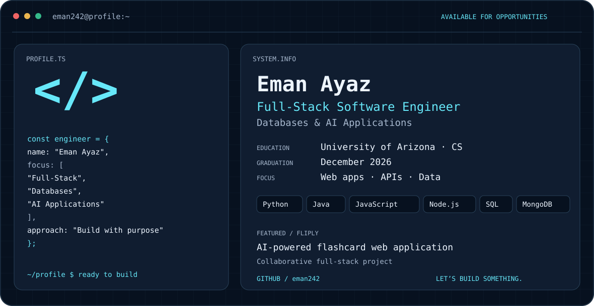

<picture>
  <source media="(prefers-color-scheme: dark)" srcset="./dark.svg">
  <source media="(prefers-color-scheme: light)" srcset="./light.svg">
  
</picture>

## Hi, I'm Eman

I'm a Computer Science student at the University of Arizona. I build full-stack applications with a focus on database design, backend development, and integrating AI into practical, user-focused solutions.

**Open to software engineering opportunities**, including full-stack development and work involving databases and AI applications.

## What I work on

- **Full-stack development:** responsive web interfaces, REST APIs, and application workflows.
- **Databases:** relational modeling, SQL queries, CRUD operations, and data validation.
- **AI applications:** LLM-powered learning features and responsible AI adoption.
- **Systems:** C programming, TCP networking, and debugging.

## Featured project

### [Fliply — AI-Powered Flashcard Web Application](https://github.com/paulinaa3/Fliply)

Collaborated on a full-stack flashcard platform with a responsive frontend, a Node.js/Express backend, and MongoDB for users, decks, and flashcards. The project incorporates LLMs to generate adaptive practice quizzes.

**Technologies:** HTML · CSS · JavaScript · Node.js · Express · MongoDB · REST APIs

## Experience

- **City of Tucson — AI Intern:** developed an internal AI knowledge hub using Igloo, HTML, and CSS; helped design an AI mentorship program; researched AI governance and created guidance and training materials.
- **University of Arizona — Course Coordinator & Undergraduate Teaching Assistant:** supported systems programming and software development courses through code review, debugging guidance, grading, and teaching assistant onboarding.
- **Shamrock — Data Intern:** developed Excel models and summaries and translated operational data into recommendations.

## Engineering stack

| Area | Technologies |
| --- | --- |
| Languages | Python, Java, JavaScript, C, SQL |
| Frontend | HTML, CSS, JavaScript |
| Backend | Node.js, Express, JDBC |
| Databases | Oracle, MongoDB |
| Data & ML libraries | Pandas, NumPy, Matplotlib, scikit-learn |
| Tools | Git, Docker, Jupyter Notebook, Microsoft Excel |

## Education

**University of Arizona — B.S. Computer Science**  
Expected graduation: **December 2026** · GPA: **3.9**

## Connect

[LinkedIn](https://www.linkedin.com/in/eman-ayaz-6ab638323/) · [GitHub](https://github.com/eman242)
